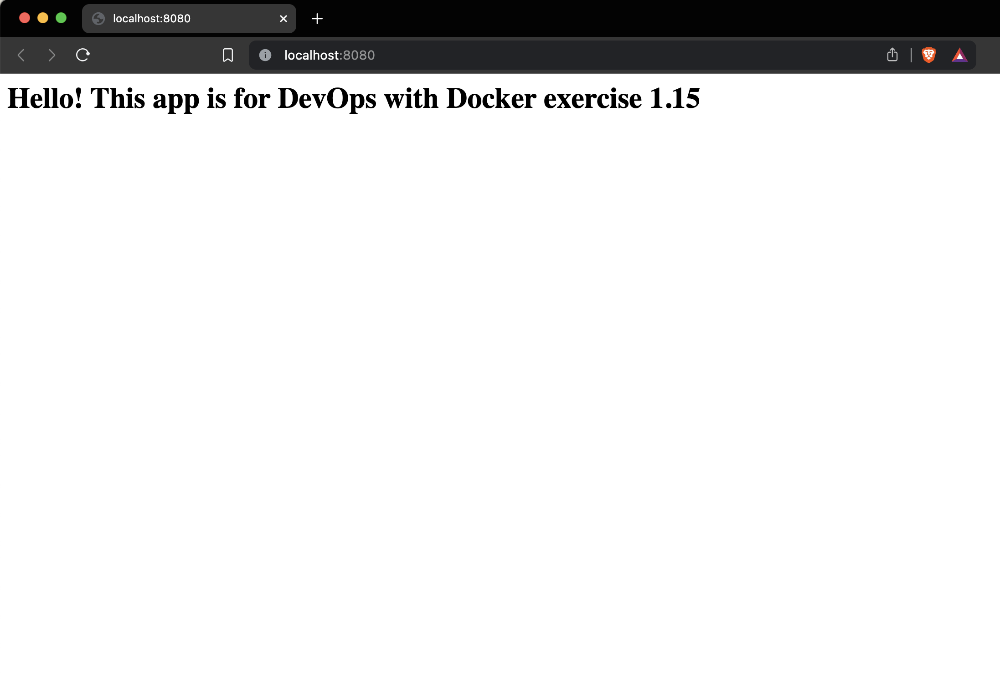

## Simple app

**To pull the image from Docker Hub**

```bash
$ docker pull nanacao/simple-web:latest
```

**To run the image**

```bash
$ docker run -p 8080:8080 nanacao/simple-web:latest
```

Access with browser http://localhost:8080

